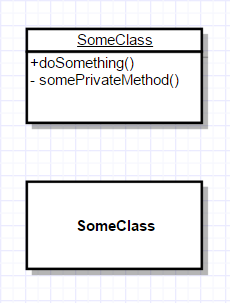
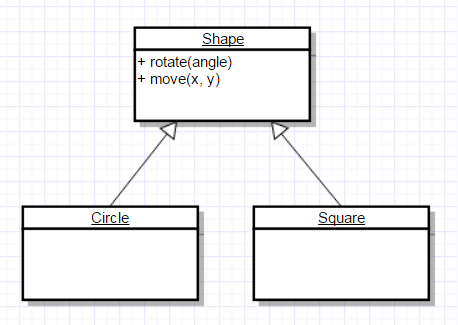
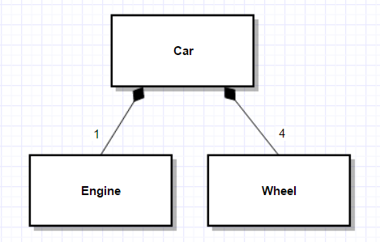

### Унифицированный язык моделирования (Unified Modeling Language, UML)

UML – это открытый стандарт, использующий графические обозначения для создания абстрактной модели системы, называемой UML-моделью. UML был создан для определения, визуализации, проектирования и документирования, в основном, программных систем. UML не является языком программирования, но на основании UML-моделей возможна генерация кода.

### Диаграмма классов (Class diagram)

Статическая структурная диаграмма, описывающая структуру системы, демонстрирующая классы системы, их атрибуты, методы и зависимости между классами.

#### Классы

Видимость:

```
+ Публичный метод (public)
# Защищенный метод (protected)
- Приватный метод (private)
```



#### Ассоциация

Показывает, что объекты связаны, бывает однонаправленной и двунаправленной.


#### Наследование

Моделирует отношение «является».



#### Реализация


#### Композиция

Моделирует отношение «содержит/является частью».

При композиции класс явно контролирует время жизни своей составной части.



#### Агрегация

Моделирует отношение «содержит/является частью».

При агрегации класс не контролирует время жизни своей части.


### Разработка через тестирование (Test-driven Development, TDD)

1. Сначала тесты
2. Тесты не проходят – это нормально
3. Написание кода
4. Отладка
5. Тесты проходят
6. PROFIT

В чем выигрыш?

1. Ускорение разработки
2. Покрытие тестами – уверенность при рефакторинге
3. Тесты – это документация которая не устаревает
4. Упрощение портирования кода

### Непрерывная интеграция (Continuous Integration, CI)

Практика разработки основанная на частых автоматизированных сборках проекта с развертыванием (deploy) и выполнением тестов.

В идеале сборки должны выполняться после каждого обновления репозитория с прогоном основных тестов.

Каждую ночь или по другому расписанию может выполняться расширенный набор тестов.

После каждого цикла разработчики получают отчет.

Преимущества:
1. Постоянное наличие текущей рабочей версии продукта
2. Немедленное выявление проблем

Сервер CI – Jenkins (https://jenkins.io).

### Уровни тестирования

##### Модульное тестирование (unit testing)

Модульное тестирование – тестирование минимально возможного компонента, например, функции или метода класса.

#### Интеграционное тестирование (integration testing)

Интеграционное тестирование – тестирование программных модулей в группе.

#### Системное тестирование

Системное тестирование – тестирование всей системы на соответствие требованиям. Знаний о внутреннем устройстве системы не требует (тестирование черного ящика) – это зона ответственности тестировщиков.

##### Пример модульного теста

```c++
TEST(StreamTest, Test1)
{
	Stream s(“ab”);
	ASSERT_TRUE(s.hasChar());
	ASSERT_EQ(‘a’, s.getChar());
	s.next();
	ASSERT_TRUE(s.hasChar());
	ASSERT_EQ(‘b’, s.getChar());
	s.next();
	ASSERT_FALSE(s.hasChar());
}

TEST(StreamTest, Test2)
{
	Stream s;
	ASSERT_FALSE(s.hasChar());
	s.next();
	ASSERT_FALSE(s.hasChar());
}
```

##### Пример интеграционного теста

```c++
TEST(XmlTokenizerTest, Test1)
{
	Stream source(“<root>5</root>”);

	XmlScanner s(source);

	ASSERT_TRUE(s.hasToken());
	ASSERT_FALSE(s.hasError());
	ASSERT_EQ(‘root’, s.getToken().name());
	ASSERT_EQ(XmlScanner::Token::Tag, s.getToken().type());

	…
}
```

#### Заглушки (mock object)

В предыдущем примере тестирование не представляло проблемы, но как быть, если вместо потока-обертки над строкой, XmlScanner требовал бы открытого файла?


```c++
class InputStream
{
	// Интерфейс
};

class FileStream
	: public InputStream
…

class MockStream
	: public InputStream
…

XmlScanner(InputStream& source);
```

#### Фреймворки для тестирования

1. Boost Test (http://boost.org)
2. CATCH (https://github.com/catchorg/Catch2)
5. Google Test + Google Mock (https://github.com/google/googletest)

#### Google Test, быстрый старт

```c++
TEST(имя набора тестов, имя теста в наборе)
{
	ASSERT_TRUE(условие);
	ASSERT_FALSE(условие);
	ASSERT_EQ(ожидаемое, полученное); // ==
	ASSERT_NE(ожидаемое, полученное); // !=
	ASSERT_LT(ожидаемое, полученное);  // <
	ASSERT_LE(ожидаемое, полученное);  // <=
	ASSERT_GT(ожидаемое, полученное);  // >
	ASSERT_GE(ожидаемое, полученное);  // >=
	ASSERT_STREQ(ожидаемое, полученное);
	ASSERT_STRCASEEQ(ожидаемое, полученное);
	ASSERT_DOUBLE_EQ(ожидаемое, полученное);
	ASSERT_NEAR(ожидаемое, полученное, погрешность);
}
```

Для перечисленных проверок есть вариант с префиксом EXPECT вместо ASSERT, разница в том, что ASSERT прерывает текущий тест, а EXPECT версия – нет.

#### Google Test, test fixtures

```c++
class TestingContext
	: public ::testing::Test
{
	Context context;
	void SetUp() override { … } 
	void TearDown() override { … }
}; 

TEST_F(TestingContext, TestSomething1)
{
	context.doSomething();
}

TEST_F(TestingContext, TestSomething2)
{
}
```

Экземпляр класса TestingContext будет создан для каждого теста, метод SetUp вызван перед тестом, TearDown после.

#### Google Test, test fixtures для набора тестов 

```c++
class TestingContext
	: public ::testing::Test
{
	static Context context;
	static void SetUpTestCase()  { … }
	static void TearDownTestCase()  { … }
	void SetUp() override { … } 
	void TearDown() override { … }
}; 

TEST_F(TestingContext, TestSomething1)
{
	context.doSomething();
}

TEST_F(TestingContext, TestSomething2) { … }
```

SetUpTestCase будет вызван перед первым тестом, TearDownTestCase после последнего. SetUp и TearDown как и раньше до и после каждого теста.

### Что еще можно тестировать?

1. Утечки памяти (memory leak)
2. Нагрузочное тестирование (load)
3. Тестирование стабильности
4. Статический анализ (static program analysis)
5. Деградация производительности

#### Valgrind

Заменяет стандартное выделение памяти своей реализацией отслеживающей корректное ее использование и освобождение. 

Позволяет определить:
1. Попытки использования неинициализированной памяти
2. Чтение/запись в память после её освобождения
3. Чтение/запись за границами выделенного блока
4. Утечки памяти

Ограничения:
1. Не отслеживает граничные ошибки при использовании статических данных или данных на стеке
2. Производительность

#### Статический анализ. CppCheck

Используется для статического анализа кода. Возможности:

1. Проверяет выход за пределы
2. Обнаруживает утечки памяти
3. Обнаруживает возможное разыменовывание NULL-указателей
4. Обнаруживает неинициализированные переменные
5. Обнаруживает неправильное использование STL
6. Проверяет обработку исключительных ситуаций на безопасность
7. Находит устаревшие и неиспользуемые функции
8. Предупреждает о неиспользуемом или бесполезном коде
9. Находит подозрительные участки кода, которые могут содержать в себе ошибки